# e-Reklamo

> A digital citizen complaint and case tracking web-based system for local government units (LGUs).

**e-Reklamo** lets citizens report community issues directly to the appropriate LGU department, track complaint status in real time, and receive updates — with an optional anonymous mode for privacy. Personnel can manage complaints, update statuses, monitor department performance, and generate analytics reports.

---

## Table of Contents

1. [Description](#description)
2. [Screenshots](#screenshots)
3. [File Structure](#file-structure)
4. [Tech Stack](#tech-stack)
5. [Developer Setup](#developer-setup)
6. [Usage](#usage)
7. [Development Process](#development-process)
8. [API Endpoints](#api-endpoints)
9. [Data Models](#data-models)
10. [React Integration](#react-integration)
11. [Dependencies](#dependencies)
12. [Configuration](#configuration)
13. [Common Issues](#common-issues)
14. [Testing](#testing)
15. [Next Steps & Roadmap](#next-steps--roadmap)
16. [Author](#author)
17. [Credits](#credits)
18. [License](#license)

---

## Description

e-Reklamo is a full-stack web application built with **Laravel 12** (backend) and **React + Inertia.js** (frontend), styled with **Tailwind CSS**. It serves two distinct user types on separate authentication guards:

- **Citizens** — register, file complaints, upload photos, track status, delete pending complaints
- **Personnel** — manage complaints, update statuses, assign cases, view analytics, manage accounts

The personnel portal is intentionally hidden at `/personnel/login` to prevent accidental access. The root URL (`/`) always redirects to the citizen login page.

---

## Screenshots

### Citizen Login Page

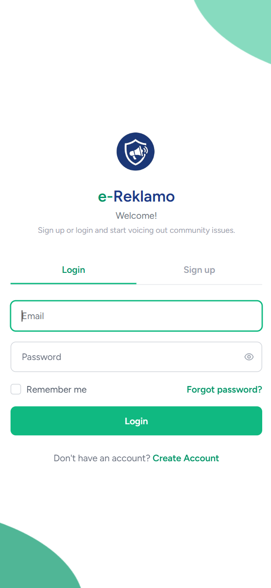

### Citizen Register Page

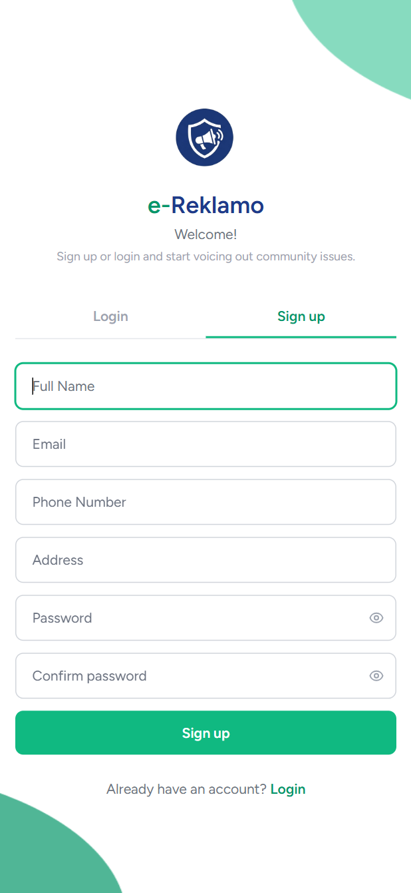

### Citizen Dashboard

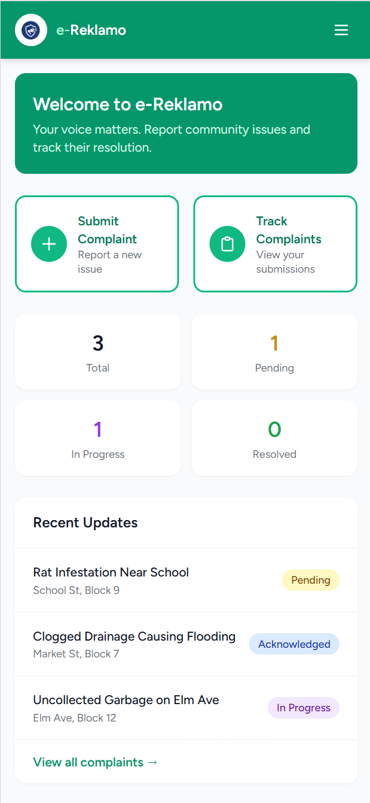

### Complaint List

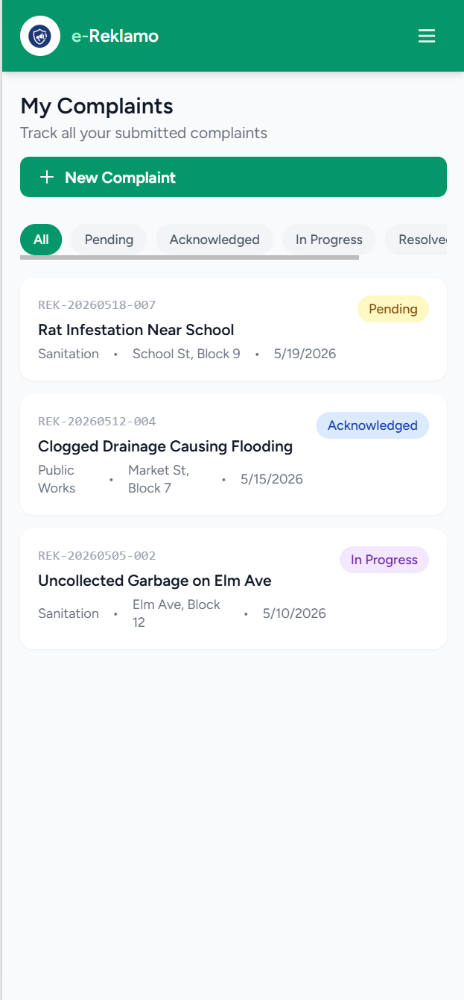

### File Complaint Form

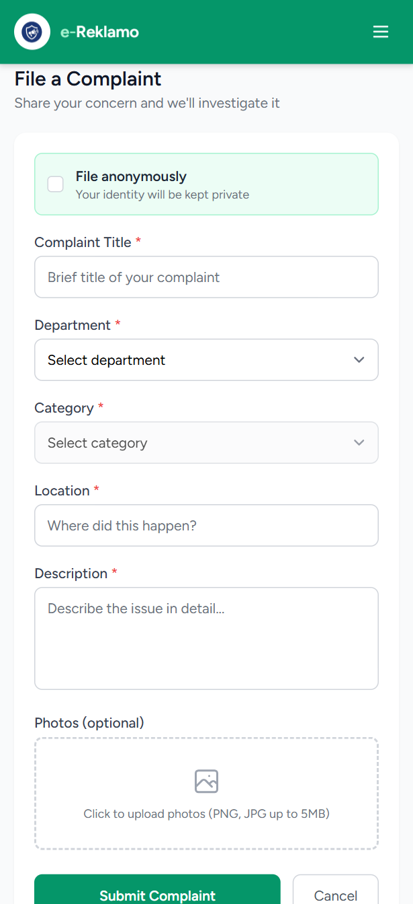

### Complaint Detail & Timeline

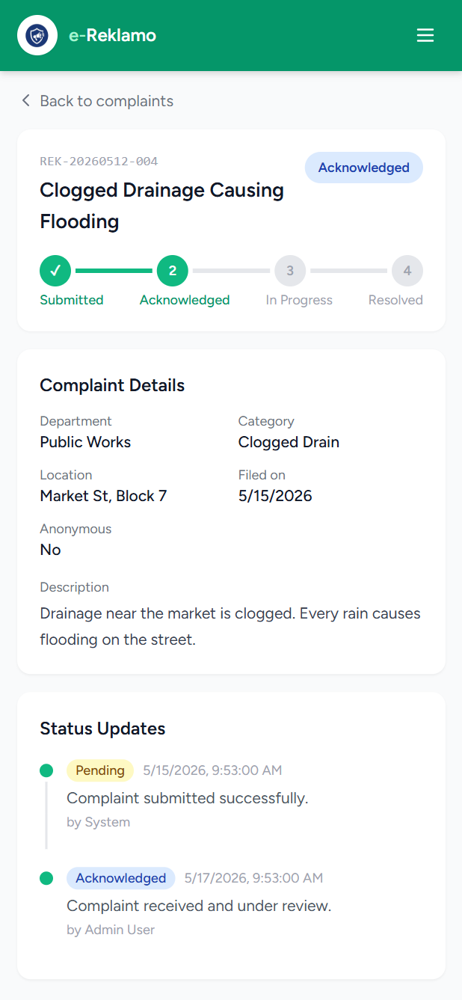

### Personnel Login Page

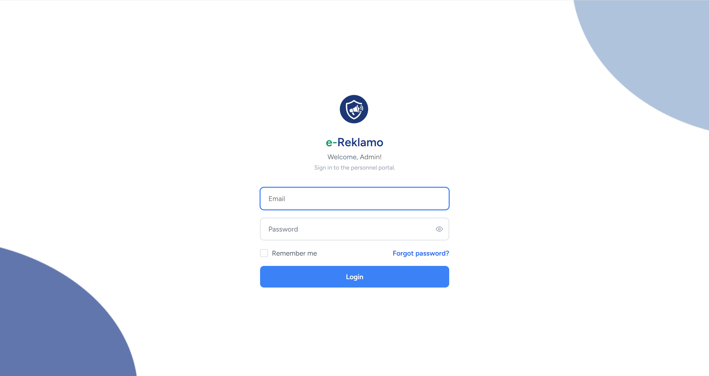

### Personnel Dashboard

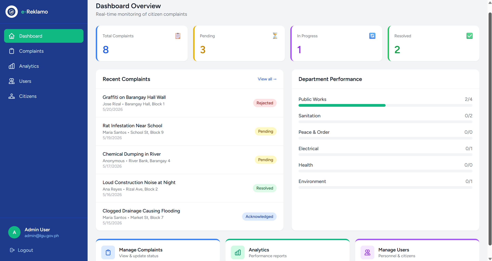

### Complaints Management List

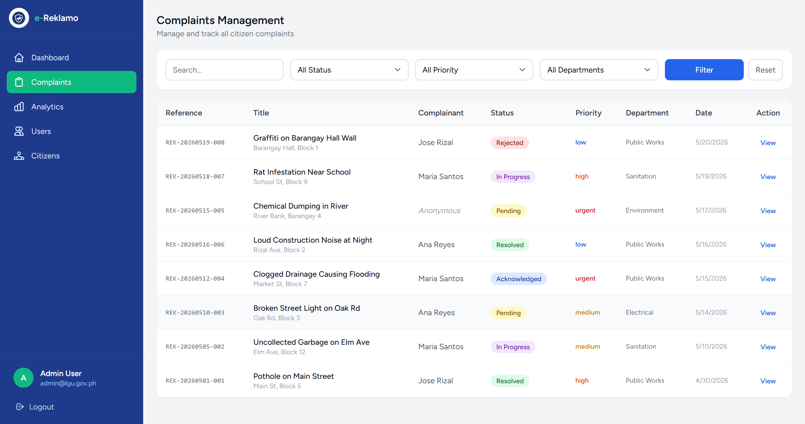

### Analytics Report

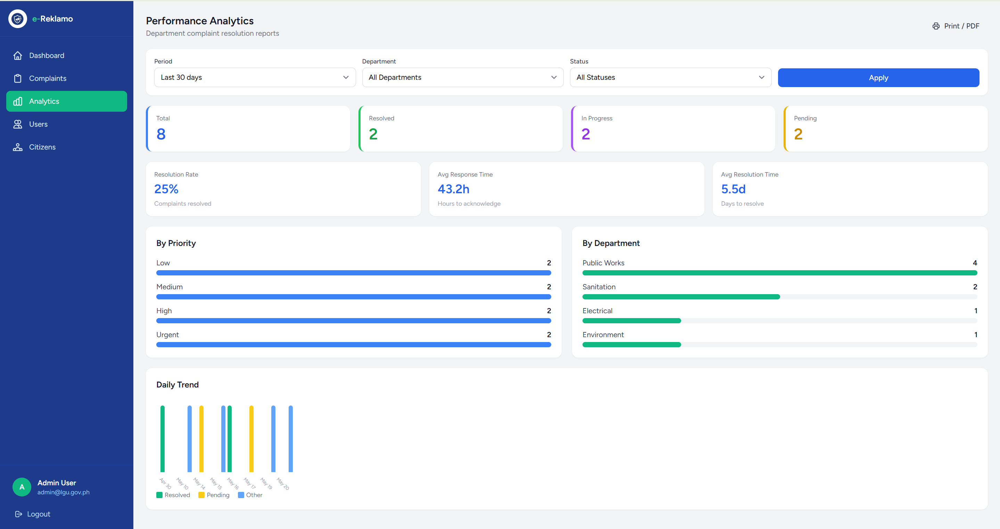

### Manage Personnel (Admin)

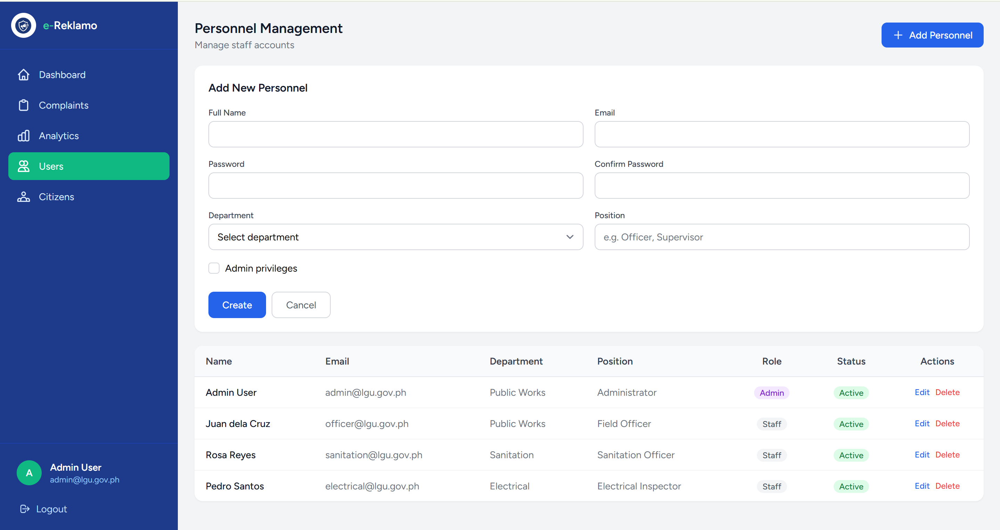

### Manage User

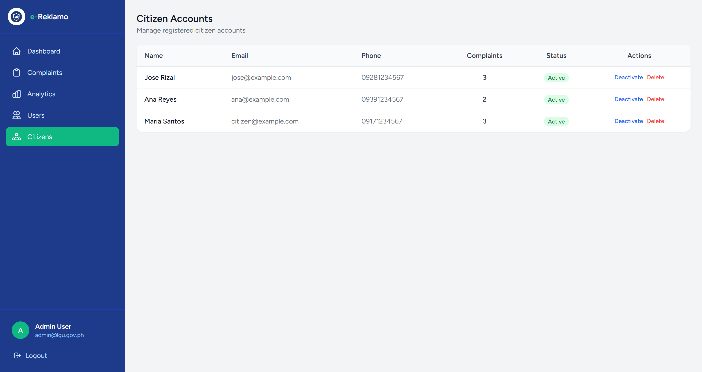

---

## File Structure

```
e-reklamo/
├── app/
│   ├── Http/
│   │   ├── Controllers/
│   │   │   ├── Auth/
│   │   │   │   ├── AuthenticatedSessionController.php   # Login/logout (citizen + personnel)
│   │   │   │   ├── CitizenRegisteredUserController.php  # Citizen registration
│   │   │   │   └── PersonnelRegisteredUserController.php
│   │   │   ├── AnalyticsController.php                  # Performance reports
│   │   │   ├── CitizenController.php                    # Citizen dashboard, complaints, profile
│   │   │   ├── ComplaintController.php                  # Complaint CRUD
│   │   │   └── PersonnelController.php                  # Personnel dashboard, user management
│   │   └── Middleware/
│   │       └── HandleInertiaRequests.php                # Shares auth + flash data to frontend
│   └── Models/
│       ├── Citizen.php          # Citizen user (separate auth guard)
│       ├── Personnel.php        # Personnel user (separate auth guard)
│       ├── Complaint.php        # Core complaint model
│       ├── ComplaintUpdate.php  # Status update history
│       ├── Department.php       # LGU departments
│       └── Category.php         # Complaint categories (per department)
├── config/
│   └── auth.php                 # Dual guard config (citizen + personnel)
├── database/
│   ├── migrations/
│   │   ├── 0000_00_00_000000_create_departments_table.php
│   │   ├── 2026_05_13_000001_create_personnel_table.php
│   │   ├── 2026_05_13_000002_create_citizens_table.php
│   │   ├── 2026_05_13_000003_refactor_complaints_table.php
│   │   └── 2026_05_13_000004_create_complaint_updates_table.php
│   └── seeders/
│       └── DatabaseSeeder.php   # Seeds departments, categories, admin account
├── resources/
│   └── js/
│       ├── Assets/images/       # Logo and ellipse design assets
│       ├── Components/          # Reusable UI components (InputError, TextInput, etc.)
│       ├── Layouts/
│       │   ├── CitizenLayout.jsx    # Green-themed citizen nav
│       │   └── PersonnelLayout.jsx  # Blue-themed sidebar layout
│       └── Pages/
│           ├── Auth/            # Login, Register, ForgotPassword, ResetPassword, PersonnelLogin
│           ├── Citizen/         # Dashboard, MyComplaints, FileComplaint, ComplaintDetail, Profile
│           └── Personnel/       # Dashboard, ComplaintsList, ComplaintDetail, Analytics,
│                                #   ManagePersonnel, ManageCitizens, Profile
├── routes/
│   └── web.php                  # All application routes
└── public/
    └── build/                   # Compiled Vite assets (auto-generated)
```

---

## Tech Stack

| Layer | Technology |
|-------|-----------|
| Backend framework | Laravel 12 (PHP 8.2+) |
| Frontend framework | React 18 |
| SPA bridge | Inertia.js v2 |
| CSS framework | Tailwind CSS v3 |
| Build tool | Vite 7 |
| Database | MySQL |
| Authentication | Laravel session guards (dual: citizen + personnel) |
| File storage | Laravel local disk (`storage/app/public`) |

---

## Developer Setup

### Prerequisites

- PHP 8.2+
- Composer
- Node.js 20.19+ or 22.12+ *(Vite 7 requirement)*
- MySQL 8+
- A local domain configured — e.g. via Laragon, XAMPP, or Herd pointing to `e-reklamo.test`

### Installation

```bash
# 1. Clone the repository
git clone https://github.com/grezamel/e-Reklamo.git
cd e-reklamo

# 2. Install PHP dependencies
composer install

# 3. Install JS dependencies
npm install

# 4. Copy environment file
cp .env.example .env

# 5. Generate app key
php artisan key:generate
```

### First-Time Setup

```bash
# 6. Configure your database in .env
DB_DATABASE=e_reklamo
DB_USERNAME=root
DB_PASSWORD=

# 7. Run migrations and seed default data
php artisan migrate:fresh --seed

# 8. Create the storage symlink (for photo uploads)
php artisan storage:link

# 9. Build frontend assets
npm run build
```

The seeder creates:
- 6 departments (Public Works, Sanitation, Peace & Order, Electrical, Health, Environment)
- Categories for each department
- Admin account: `admin@lgu.gov.ph` / `password`
- Staff account: `officer@lgu.gov.ph` / `password`
- Sample citizen: `citizen@example.com` / `password`

### Running the App

**Development (two terminals):**

```bash
# Terminal 1 — Laravel dev server
php artisan serve

# Terminal 2 — Vite hot reload
npm run dev
```

**Production:**

```bash
npm run build
php artisan config:cache
php artisan route:cache
```

### First-Time Setup Issues

| Issue | Fix |
|-------|-----|
| `npm run build` fails with Node version error | Upgrade Node.js to 20.19+ or 22.12+ |
| `php artisan migrate` fails | Check `DB_*` values in `.env`; ensure MySQL is running |
| Images not loading | Run `php artisan storage:link` |
| 419 CSRF error on forms | Clear browser cookies or run `php artisan config:clear` |
| Vite assets 404 in production | Run `npm run build` and ensure `public/build/` exists |

---

## API Endpoints

All routes are web routes (session-based, not REST API). Inertia.js handles the SPA navigation.

### Citizen Routes (`/citizen/*`)

| Method | URI | Name | Description |
|--------|-----|------|-------------|
| GET | `/login` | `login` | Citizen login page |
| POST | `/login` | — | Authenticate citizen |
| GET | `/register` | `register` | Citizen registration page |
| POST | `/register` | `citizen.register` | Create citizen account |
| GET | `/citizen/dashboard` | `citizen.dashboard` | Citizen home |
| GET | `/citizen/complaints` | `citizen.complaints.index` | List own complaints |
| GET | `/citizen/complaints/new` | `citizen.complaints.new` | File complaint form |
| POST | `/citizen/complaints` | `citizen.complaints.store` | Submit complaint |
| GET | `/citizen/complaints/{id}` | `citizen.complaints.show` | Complaint detail |
| DELETE | `/citizen/complaints/{id}` | `citizen.complaints.destroy` | Delete complaint (pending/rejected only) |
| GET | `/citizen/profile` | `citizen.profile.edit` | Edit profile |
| PATCH | `/citizen/profile` | `citizen.profile.update` | Update profile |
| POST | `/citizen/logout` | `citizen.logout` | Logout |

### Personnel Routes (`/personnel/*`)

| Method | URI | Name | Description |
|--------|-----|------|-------------|
| GET | `/personnel/login` | `personnel.login` | Personnel login page |
| POST | `/personnel/login` | — | Authenticate personnel |
| GET | `/personnel/dashboard` | `personnel.dashboard` | Personnel home |
| GET | `/personnel/complaints` | `personnel.complaints.index` | All complaints (filterable) |
| GET | `/personnel/complaints/{id}` | `personnel.complaints.show` | Complaint detail |
| POST | `/personnel/complaints/{id}/status` | `personnel.complaints.updateStatus` | Update status + remarks |
| POST | `/personnel/complaints/{id}/assign` | `personnel.complaints.assign` | Assign to personnel |
| DELETE | `/personnel/complaints/{id}` | `personnel.complaints.destroy` | Delete complaint (admin only) |
| GET | `/personnel/analytics` | `personnel.analytics` | Analytics dashboard |
| GET | `/personnel/analytics/export` | `personnel.analytics.export` | Export report data |
| GET | `/personnel/users` | `personnel.personnel.index` | Manage personnel (admin) |
| POST | `/personnel/users` | `personnel.personnel.store` | Add personnel (admin) |
| PATCH | `/personnel/users/{id}` | `personnel.personnel.update` | Edit personnel (admin) |
| DELETE | `/personnel/users/{id}` | `personnel.personnel.destroy` | Delete personnel (admin) |
| GET | `/personnel/citizens` | `personnel.citizens.index` | Manage citizen accounts |
| PATCH | `/personnel/citizens/{id}` | `personnel.citizens.update` | Toggle citizen active status |
| DELETE | `/personnel/citizens/{id}` | `personnel.citizens.destroy` | Delete citizen (admin) |
| POST | `/personnel/logout` | `personnel.logout` | Logout |

---

## Data Models

### Citizen (`citizens` table)

| Column | Type | Notes |
|--------|------|-------|
| id | bigint | Primary key |
| name | string | Full name |
| email | string | Unique |
| password | string | Hashed |
| phone | string | Optional |
| address | text | Optional |
| is_anonymous | boolean | Default false |
| is_active | boolean | Default true |
| email_verified_at | timestamp | Optional |
| remember_token | string | — |

### Personnel (`personnel` table)

| Column | Type | Notes |
|--------|------|-------|
| id | bigint | Primary key |
| name | string | Full name |
| email | string | Unique |
| password | string | Hashed |
| department_id | FK | Nullable |
| position | string | e.g. Officer, Supervisor |
| is_admin | boolean | Admin privileges |
| is_active | boolean | Default true |

### Complaint (`complaints` table)

| Column | Type | Notes |
|--------|------|-------|
| reference_number | string | Unique, e.g. `REK-20260513-ABC` |
| citizen_id | FK | References `citizens` |
| assigned_to | FK | References `personnel` (nullable) |
| department_id | FK | References `departments` |
| category_id | FK | References `categories` |
| title | string | — |
| description | text | — |
| location | string | — |
| photos | JSON | Array of storage paths |
| status | enum | `pending`, `acknowledged`, `in-progress`, `resolved`, `rejected` |
| priority | enum | `low`, `medium`, `high`, `urgent` |
| remarks | text | Personnel notes |
| is_anonymous | boolean | Hides citizen identity |
| acknowledged_at | timestamp | Set on first acknowledgement |
| resolved_at | timestamp | Set on resolution |

### Relationships

```
Department  ──< Category
Department  ──< Personnel
Department  ──< Complaint
Citizen     ──< Complaint
Personnel   ──< Complaint (assigned_to)
Complaint   ──< ComplaintUpdate
```

---

## React Integration

This project uses **Inertia.js** as the bridge between Laravel and React — no separate API or JSON responses needed for page rendering.

- Laravel controllers return `Inertia::render('PageName', $props)` instead of JSON or Blade views
- React pages live in `resources/js/Pages/`
- Shared data (auth user, flash messages) is passed via `HandleInertiaRequests.php`
- Client-side navigation uses Inertia's `<Link>` component and `router` helper
- Forms use Inertia's `useForm()` hook which handles CSRF, validation errors, and redirects automatically

**Asset imports** use the `@/` alias which maps to `resources/js/`:

```js
import logo from '@/Assets/images/eReklamo_logo.png';
```

---

## Dependencies

### PHP (composer.json)

| Package | Purpose |
|---------|---------|
| `laravel/framework ^12` | Core framework |
| `inertiajs/inertia-laravel ^2` | Inertia server-side adapter |
| `tightenco/ziggy ^2` | Exposes Laravel routes to JS (`route()` helper) |
| `laravel/sanctum ^4` | API token support (available if needed) |

### JavaScript (package.json)

| Package | Purpose |
|---------|---------|
| `react ^18` | UI library |
| `@inertiajs/react ^2` | Inertia React adapter |
| `@headlessui/react ^2` | Accessible UI primitives |
| `tailwindcss ^3` | Utility-first CSS |
| `@tailwindcss/forms ^0.5` | Form element base styles |
| `vite ^7` | Build tool |
| `laravel-vite-plugin ^2` | Vite + Laravel integration |
| `axios ^1` | HTTP client (available for custom requests) |

---

## Configuration

Key `.env` values:

```env
APP_NAME="e-Reklamo"
APP_URL=http://e-reklamo.test

DB_CONNECTION=mysql
DB_DATABASE=e_reklamo
DB_USERNAME=root
DB_PASSWORD=

FILESYSTEM_DISK=local        # Photo uploads go to storage/app/public
MAIL_MAILER=log              # Emails logged locally (no real mail in dev)
```

Authentication guards are configured in `config/auth.php`:

```php
'guards' => [
    'citizen'   => ['driver' => 'session', 'provider' => 'citizens'],
    'personnel' => ['driver' => 'session', 'provider' => 'personnel'],
],
```

---

## Common Issues

| Problem | Cause | Fix |
|---------|-------|-----|
| Login redirects back with no error | Wrong guard (citizen trying personnel URL or vice versa) | Use `/login` for citizens, `/personnel/login` for personnel |
| "419 Page Expired" | CSRF token mismatch | Refresh the page; check `SESSION_DRIVER` in `.env` |
| Photos not displaying | Storage symlink missing | `php artisan storage:link` |
| Route not found after adding new route | Route cache stale | `php artisan route:clear` |
| Vite `@/` import fails | Alias not resolving | Ensure `vite.config.js` uses `laravel-vite-plugin` (it sets `@/` automatically) |
| `npm run build` Node version error | Node < 20.19 | Upgrade Node.js |
| Seeder fails with FK constraint | Migrations ran out of order | `php artisan migrate:fresh --seed` |
| Personnel can't see admin menu | `is_admin` is false | Update via tinker: `Personnel::find(1)->update(['is_admin' => true])` |

---

## Development Process

### Code Generation Workflow

**Adding a new migration:**
```bash
php artisan make:migration add_column_to_table
php artisan migrate
```

**Adding a new seeder:**
```bash
php artisan make:seeder NameSeeder
# Add to DatabaseSeeder::run(), then:
php artisan db:seed --class=NameSeeder
```

**Full reset (dev only):**
```bash
php artisan migrate:fresh --seed
```

**Clearing all caches:**
```bash
php artisan optimize:clear
```

### Adding a New Page

1. Create `resources/js/Pages/Section/PageName.jsx`
2. Add a route in `routes/web.php` pointing to a controller method
3. Return `Inertia::render('Section/PageName', $data)` from the controller
4. Run `npm run dev` — Vite picks up the new file automatically

---

## Testing

### Running Tests

```bash
php artisan test
```

Or with coverage (requires Xdebug):
```bash
php artisan test --coverage
```

### Test Structure

```
tests/
├── Feature/     # HTTP/integration tests (routes, controllers, auth)
└── Unit/        # Model and logic unit tests
```

Tests use an in-memory SQLite database by default (configured in `phpunit.xml`). No test suite has been written yet — see [Next Steps](#next-steps--roadmap).

---

## Next Steps & Roadmap

### Planned Features

- [ ] **Machine learning integration** — auto-categorize complaints using NLP on the title/description; predict resolution time based on historical data; flag duplicate or spam complaints
- [ ] **Email/SMS notifications** — notify citizens when their complaint status changes
- [ ] **Real-time updates** — use Laravel Echo + Pusher (or Reverb) for live status changes without page refresh
- [ ] **Complaint escalation** — auto-escalate complaints that exceed SLA response time
- [ ] **Department SLA configuration** — let admins set target response/resolution times per department
- [ ] **Bulk complaint actions** — assign or update status for multiple complaints at once
- [ ] **Map integration** — plot complaint locations on a map (Leaflet.js or Google Maps)
- [ ] **Citizen notification preferences** — opt in/out of email updates per complaint
- [ ] **Export to Excel** — download complaint data as `.xlsx` in addition to PDF print
- [ ] **Two-factor authentication** — for personnel accounts
- [ ] **Audit log** — track all admin actions (who changed what and when)
- [ ] **Mobile app** — React Native wrapper using the same Laravel backend
- [ ] **Full test suite** — Feature tests for all routes and auth flows

---

## Author

**Grezamel Tabitha Lagasca**
- GitHub: [@grezamel](https://github.com/grezamel)

---

## Credits

- [Laravel](https://laravel.com) — PHP framework
- [React](https://react.dev) — UI library
- [Inertia.js](https://inertiajs.com) — SPA bridge
- [Tailwind CSS](https://tailwindcss.com) — CSS framework
- [Headless UI](https://headlessui.com) — Accessible components
- [Vite](https://vitejs.dev) — Build tool

---

## Links

- Local dev URL: [http://e-reklamo.test](http://e-reklamo.test)
- Personnel portal: [http://e-reklamo.test/personnel/login](http://e-reklamo.test/personnel/login)

---

## License

This project is licensed under the **Creative Commons Attribution-NonCommercial 4.0 International (CC BY-NC 4.0)** license.

You are free to view and reference this project. You may **not** use it for commercial purposes, and educational institutions may **not** use it for grading, institutional profit, or submission as their own work without explicit written permission from the author.

See the [LICENSE](./LICENSE) file for full terms, or visit [creativecommons.org/licenses/by-nc/4.0](https://creativecommons.org/licenses/by-nc/4.0/).
